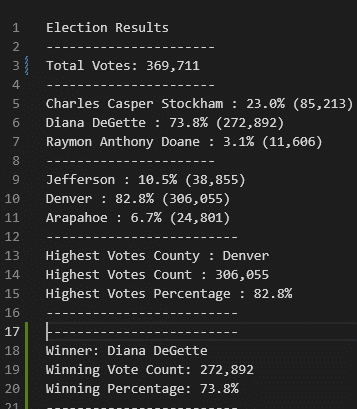
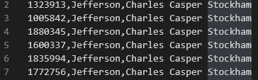

##Election_Analysis
---
#Overview of Project
Our client Tom a Colorado board of elections an employee has tasked us to create a python program that will automatically count the ballets determine the winner. If successful this program will be used to count the votes of other counties. 
1.	Calculate the total number of votes cast. 
2.	Get a complete list of the candidates who recived votes.
3.	Caculate the total number of votes each candidate received. 
4.	Calculate the percentage of votes each candidate won. 
5.	Determin the winner of the election based on popular vote.

#Resources
-Data Source : eleciton_results.csv
-Software: Python 3.6.1, Visual Studio Code, 1.38.1

#Summary
The analysis of the election shows that : 
-There were 367,711 total votes in the election
-The candidates were:
	-Charles Casper Stockham
	-Diana Degette
	-Raymon Anthony Doane
-The candidate results were: 
	-Charles Casper Stockham with 85,213 with 23% of the votes
	-Diana Degette with 272,892 of the votes with 73.8% of the votes
	-Raymon Anthony Doane with 11,606 with only 3.1% of the votes
-The winner of the election :
-Diana Degette, who received 73.8% of the votes and 272,892 of the votes

#Election-Audit Results:
So far this program is pretty powerful being able to grab the name and count the votes for every candidate no matter how many. The only limitation is that the table must be made in a specific way(as seen below) with the county being in the second column and the candidate being in the third. This can easily be fixed by making those variables that can easily be changed at the top of the code. It can also be fix by having it read based on column name rather then column number. If we want to be even more complex, we could create a prompt that asks for the file name/location. Then prompting the user which row/column the data is set. We can also take another step and have the program display the headers in a drop down to pick. 

